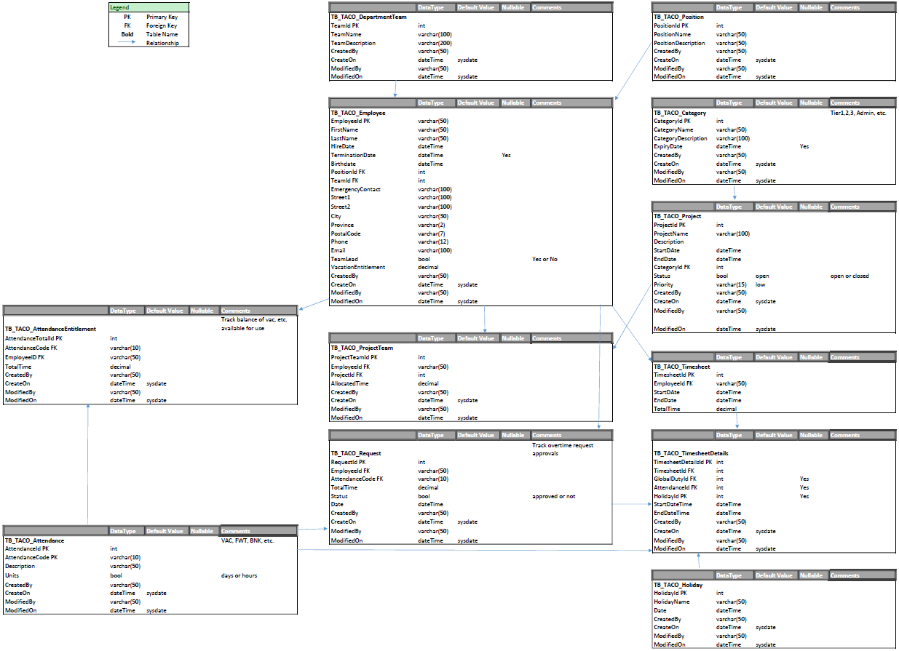

**TACO Time managment and forecasting web application**

## Contributors

- ***Aaron Carlson*** [**Email**](aheadon1@studentmail.nait.ca) 
- ***Anton Drantiev*** [**Email**](adrantiev1@studentmail.nait.ca) 
- ***Emily Urdaneta*** [**Email**](eurdaneta1@studentmail.nait.ca) 
- ***Prince Selhi*** [**Email**](pselhi1@studentmail.nait.ca) 
- ***Pavel Tsaryov*** [**Email**](ptsarev1@studentmail.nait.ca) 

## Work Rules:
- **Pull currnet barnch before starting to work**
- **We all work on the 'dev_branch'**
- **Master will be handled only by one person (To avoid merge conflicts)**
- **After you done coding and if your code is deployable, push it to the dev_branch**
- **The dev_branch will be checked before it get merged to master**
- **Please make meaningful comments**

## ERD

